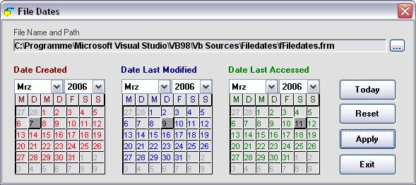



## File Dates \(Update\)

### Description

This little program lets you alter file dates: date created, date last modified, and date last accessed. Download is just 7.2 kB. Give it a try.

Update now lets you also drag'n'drop files onto the app without using the browser.
 
### More Info
 

             |
---                |---
**Submitted On**   |2006-03-12 07:26:00
**By**             |[ULLI](https://github.com/Planet-Source-Code/PSCIndex/blob/master/ByAuthor/ulli.md)
**Level**          |Intermediate
**User Rating**    |5.0 (15 globes from 3 users)
**Compatibility**  |VB 6\.0
**Category**       |[Files/ File Controls/ Input/ Output](https://github.com/Planet-Source-Code/PSCIndex/blob/master/ByCategory/files-file-controls-input-output__1-3.md)
**World**          |[Visual Basic](https://github.com/Planet-Source-Code/PSCIndex/blob/master/ByWorld/visual-basic.md)
**Archive File**   |[File\_Dates1979603122006\.zip](https://github.com/Planet-Source-Code/ulli-file-dates-update__1-64614/archive/master.zip)

